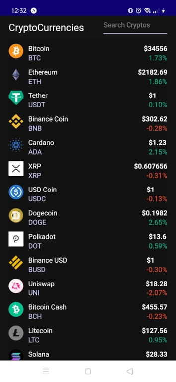
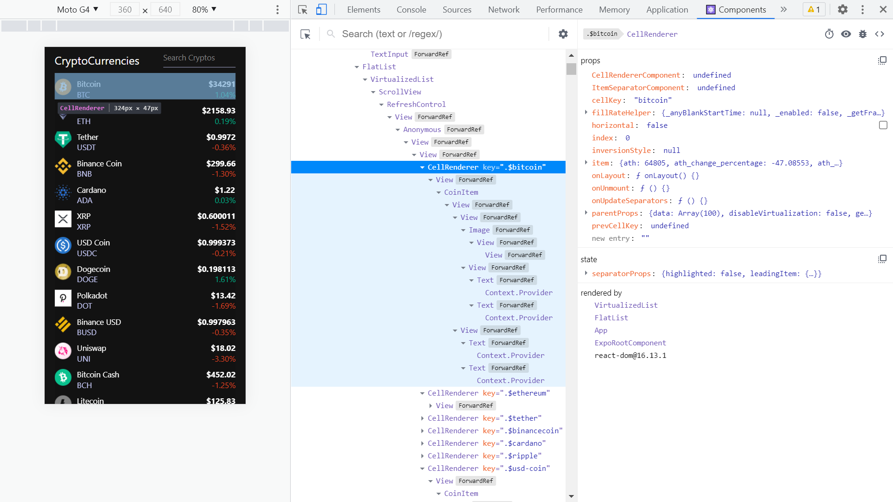

# :zap: React Native Cryptos

* React-Native app to display cryptocurrency API data
* Tutorial code from [Fazt Code](https://www.youtube.com/channel/UCMn28O1sQGochG94HdlthbA) - see [:clap: Inspiration](#clap-inspiration) below
* **Note:** to open web links in a new window use: _ctrl+click on link_


## :page_facing_up: Table of contents

* [:zap: React Native Cryptos](#zap-react-native-cryptos)
  * [:page_facing_up: Table of contents](#page_facing_up-table-of-contents)
  * [:books: General info](#books-general-info)
  * [:camera: Screenshots](#camera-screenshots)
  * [:signal_strength: Technologies](#signal_strength-technologies)
  * [:floppy_disk: Setup](#floppy_disk-setup)
  * [:computer: Code Example by Fazt Code](#computer-code-example-by-fazt-code)
  * [:cool: Features](#cool-features)
  * [:clipboard: Status & To-do list](#clipboard-status--to-do-list)
  * [:clap: Inspiration](#clap-inspiration)
  * [:file_folder: License](#file_folder-license)
  * [:envelope: Contact](#envelope-contact)

## :books: General info

* Cryptocurrency data from the [CoinGecko API](https://www.coingecko.com/en/api) and does not require an API key
* React [useEffect hook](https://reactjs.org/docs/hooks-effect.html) used for data fetching
* React [useState hook](https://reactjs.org/docs/hooks-state.html) used to initialise & update coins, refeshing and search states

## :camera: Screenshots




## :signal_strength: Technologies

* [Expo v44](https://docs.expo.io/) framework & platform for universal React applications, installed globally
* [React Native v0.67.4](https://reactnative.dev/) to create native app for Android and iOS
* [react-native-web v0.17.7](https://www.npmjs.com/package/react-native-web) React Native Components and APIs for the Web.
* [React v17](https://reactjs.org/) JavaScript library for building user interfaces
* [Android Studio v4](https://developer.android.com/studio) installed globally, used to simulate Android device

## :floppy_disk: Setup

* Run `npm i` to install dependencies
* `npm install -g expo-cli --force` to install Expo CLI globally (force option may not be required)
* Run `npm start` to start expo on a localhost port
* See `package.json` for the npm commands to create build files etc.
* Android Studio has to be installed and set up then the AVD Manager is run from the Configure menu

## :computer: Code Example by Fazt Code

* Code by Fazt Code to display Cryptocurrency data. Includes ternery expression to show price change data in green or red

```javascript
const CoinItem = ({ coin }) => (
  <View style={styles.containerItem}>
    <View style={styles.coinName}>
      <Image source={{ uri: coin.image }} style={styles.image} />
      <View style={styles.containerNames}>
        <Text style={styles.text}>{coin.name}</Text>
        <Text style={styles.textSymbol}>{coin.symbol}</Text>
      </View>
    </View>
    <View>
      <Text style={styles.textPrice}>${coin.current_price}</Text>
      <Text
        style={[
          styles.pricePercentage,
          coin.price_change_percentage_24h > 0
            ? styles.priceUp
            : styles.priceDown,
        ]}
      >
        {coin.price_change_percentage_24h.toFixed(2)}%
      </Text>
    </View>
  </View>
);
```

## :cool: Features

* Expo bar code used to connect mobile to project. The Expo framework is easy to use.
* Android Studio simulation on mobile device

## :clipboard: Status & To-do list

* Status: Working
* To-do: Nothing.

## :clap: Inspiration

* [Fazt Code: React Native & CoinGecko | Aplicación de Precios de Criptomonedas](https://www.youtube.com/watch?v=k9ptn9zNHng&t=38s) in Spanish

## :file_folder: License

* N/A

## :envelope: Contact

* Repo created by [ABateman](https://github.com/AndrewJBateman), email: gomezbateman@yahoo.com
